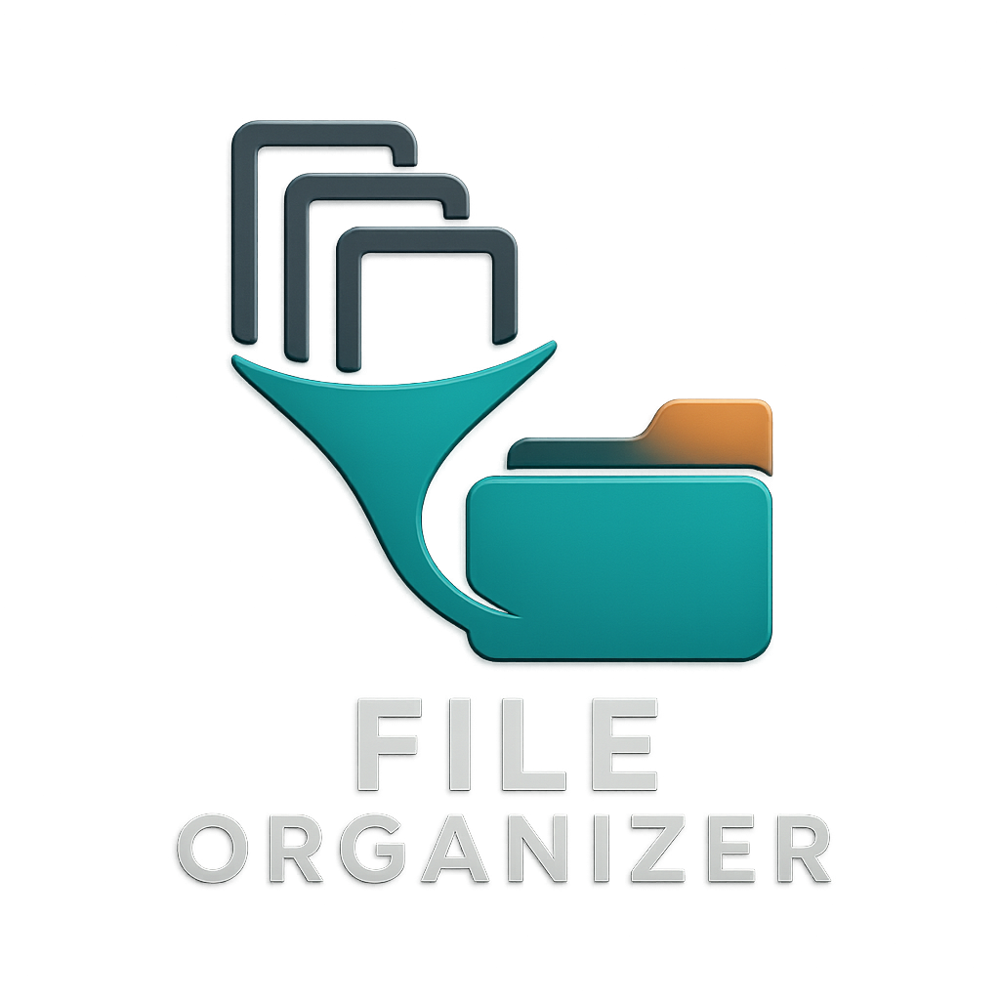
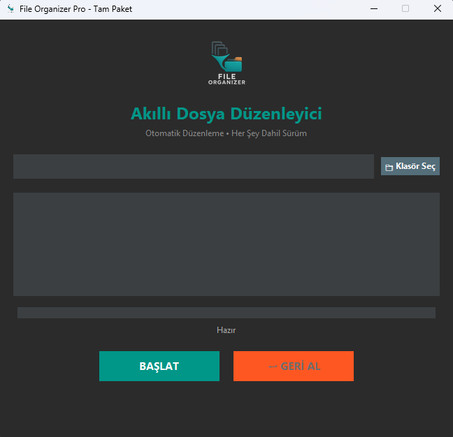

# 📂 File Organizer Pro (Otomatik Dosya Düzenleyici)




**File Organizer Pro**, karmaşık klasörlerinizi (örneğin İndirilenler, Masaüstü) saniyeler içinde analiz eden, dosyaları türlerine göre (Resimler, Belgeler, Videolar vb.) kategorize eden ve düzenleyen **akıllı bir masaüstü uygulamasıdır.**

> *"Tek tıkla kaos düzeni, maksimum verimlilik."*



# 🌟 Öne Çıkan Özellikler

* **🚀 Tam Otomatik:** Dosyaları uzantılarına göre algılar ve ilgili klasörlere taşır.
* **🛡️ Akıllı Çakışma Yönetimi (Duplicate Handling):** Hedef klasörde aynı isimde dosya varsa üzerine **yazmaz**. Bunları özel bir *"Aynı Dosyalar (Duplicates)"* klasörüne ayırır. Veri kaybı yaşatmaz.
* **↩️ Geri Alma (Undo):** Yanlışlıkla mı bastınız? "Geri Al" butonu ile yapılan tüm işlemleri saniyesinde geri döndürebilirsiniz.
* **🎨 Modern Arayüz:** Göz yormayan "Dark Mode" tasarımı ve kullanıcı dostu arayüz.
* **⚡ Donmayan Performans:** İşlemleri arka planda (multithreading) yapar, arayüz donmaz.
* **📦 Kurulumsuz (Portable):** Tek bir `.exe` dosyasıdır. Kurulum gerektirmez, USB'den bile çalışır.

## 📥 İndirme ve Kullanım (Kullanıcılar İçin)

`.exe`  dist klasörününü içinde bulunmaktadır

Programı Python bilmenize gerek kalmadan hemen kullanabilirsiniz:

1.  Bu sayfanın sağ tarafındaki **"Releases"** kısmından en son sürümü (`DosyaDuzenleyici_Pro.exe`) indirin.
2.  İndirdiğiniz `.exe` dosyasına çift tıklayın.
3.  **"Klasör Seç"** butonuna basarak düzenlemek istediğiniz klasörü seçin (Örn: İndirilenler).
4.  **"BAŞLAT"** butonuna basın ve arkanıza yaslanın!

## 📂 Desteklenen Dosya Türleri

Uygulama aşağıdaki kategorileri otomatik oluşturur:

| Kategori | Uzantılar |
| :--- | :--- |
| **🖼️ Resimler** | `.jpg`, `.jpeg`, `.png`, `.gif`, `.bmp`, `.svg`, `.webp`, `.tiff`, `.ico` |
| **📄 Belgeler** | `.pdf`, `.docx`, `.doc`, `.txt`, `.xlsx`, `.pptx`, `.csv`, `.rtf` |
| **🎬 Videolar** | `.mp4`, `.mkv`, `.avi`, `.mov`, `.wmv`, `.flv`, `.webm` |
| **🎵 Müzikler** | `.mp3`, `.wav`, `.flac`, `.aac`, `.ogg` |
| **📦 Arşivler** | `.zip`, `.rar`, `.7z`, `.tar`, `.gz`, `.iso` |
| **💾 Programlar**| `.exe`, `.msi`, `.dmg`, `.pkg`, `.py`, `.js` |
| **🎨 Tasarım** | `.psd`, `.ai`, `.xd`, `.sketch`, `.blend` |

*(Tanımlanamayan diğer dosyalar "Diğer" klasörüne taşınır.)*

## 🛠️ Kurulum (Geliştiriciler İçin)

Eğer kaynak kodunu geliştirmek veya incelemek isterseniz:

1.  Repoyu klonlayın:
    ```bash
    # Windows (PowerShell)
    git clone https://github.com/Omer-Murat/File-Organizer-Pro.git
    cd File-Organizer-Pro
    ```

2.  Gerekli kütüphaneyi yükleyin (Pillow):
    ```bash
    # Windows (PowerShell)
    pip install Pillow
    ```

3.  Uygulamayı çalıştırın:
    ```bash
    # Windows (PowerShell)
    python File-Organizer-Tool-Pro.py
    ```

### 📦EXE Nasıl Derlenir? (Build)
Projeyi tek dosya haline getirmek için PyInstaller kullanılır:

```bash
# Windows (PowerShell)
python -m PyInstaller --noconsole --onefile --icon=logo.png --add-data "logo.png;." --name="DosyaDuzenleyici_Pro" File-Organizer-Tool-Pro.py
 ```
Not: Bu proje eğitim amaçlıdır. Telif haklarına saygı gösteriniz.

Geliştirici: Ömer Murat
